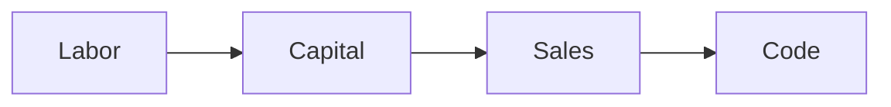

Hello, folks! Welcome to my TIL blog!

My name is Diogo and through this blog, I would like to share my **daily** learning journey and provide you with valuable insights that will enhance your coding skills. My goal is to share thought-provoking facts and insights from a variety of Engineer fields that uses code.

You may have heard that coding is cold and hard, but that's not true. Coding can be truly exciting and inspiring, as it offers endless opportunities to create innovative solutions with the power to revolutionize the world around us. Coding allows us to create amazing things, from innovative apps and platforms to disruptive technologies that shape our lives. When it comes to the possibilities of coding, there is a framework that outlines how to generate income, as presented by Alex Hormozi in his most recent [podcast on Spotify](https://open.spotify.com/show/6YNopzKDGDwf0auIpPTIID). In essence,

I will explain what this means. But first, keep in mind that
 
Labor \* Lavrage = Capital.
 
We all have the same TIME to work in the day: 24 hours. Therefore, what change is how **effective** it can be. How can you create leverage? How can you achieve the best outcome by prioritizing certain activities? That is what code is about! Making the biggest impact with the less time possible.

Returning to the framework... There are three main ways of earning income: Labor, where you work for someone and get paid; Capital, where you invest your money and make it work for you; Sales, where you influence others to buy from you. However, the **most powerful** way to create leverage is through _code_, as a single piece of code can achieve millions of People.

Imagine you're using Facebook and you see a ton of ads and sponsored posts all over the place. But have you ever thought about who really owns all of the data that you and millions of other users provide to the platform? It's not the advertisers or even the users themselves, but rather Facebook that has complete possession of it all.
Can you imagine for just a moment how important it is to learn to code?

As I said, it's not difficult: it's just inputs and outputs. If you're willing to put in the effort, coding is accessible to **anyone** with the right resources and mindset. So, here are five topics that will unleash the right mindset:

1. The Abundance of Resources: There are numerous online resources available to learn to code for free or at a low cost making it easier than ever to access coding knowledge. These resources include blogs (👀 maybe... like this one?), coding courses, and online communities where learners can share knowledge and seek help.

2. Logical and Structured: Coding is a logical and structured activity that involves **breaking down complex problems into smaller**, more manageable tasks. This structure makes it easier for learners to understand and follow the steps needed to solve a problem or create a program.

3. Learn by Doing: One of the best ways to learn to code is by **doing it**. 'll give you some fun and practical projects to work on so you can apply what you've learned. This way, you can get a better grip on coding concepts and actually remember them!

4. Instant Feedback: When you code, you get **instant** feedback on whether your code works or needs some change. This immediate feedback allows learners to identify and correct mistakes quickly, which helps to reinforce learning and build confidence.

5. MVP(Minimum Viable Product): Have you ever imagined bringing your one-of-a-kind solution to real-world problems into existence? Coding allows you to create things from scratch and bring your ideas to life. Virtually all that exists can be put online and scaled — only possible by coding.

Don't let code intimidate you, instead embrace its potential and discover the incredible things that you can accomplish with it. Whether you're a beginner or an experienced coder, a student, a professional, or just someone who loves to learn each day, I'll bring you new and fascinating **bits** of information that will spark your curiosity and inspire you to explore even further. Come with me and let's learn something new together. Let's grow as a community. Therefore, join Me on my coding Journey and unleash your power of code, one line at a time.
